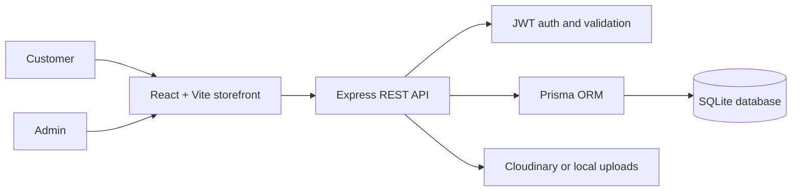
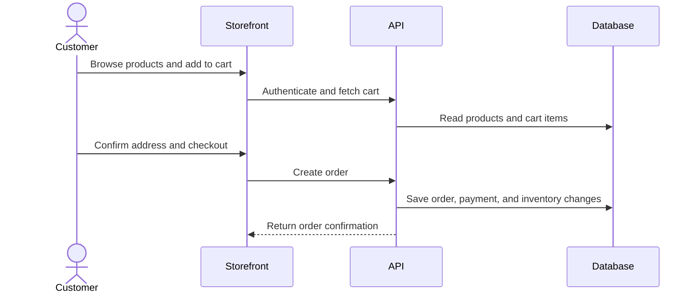

<div align="center">
  
  <h1>Grocery Shop</h1>
  <p>A polished, full-stack grocery store built for convenient everyday shopping.</p>

  <p>
    <a href="#quick-start">Get started</a> ·
    <a href="#features">Explore features</a> ·
    <a href="#architecture">See the architecture</a>
  </p>

  
</div>

<br />

> A complete shopping experience from product discovery to delivery-ready order management, with a dedicated admin workspace behind it.


## Why Grocery Shop?

Grocery Shop is a production-minded e-commerce application for local grocery businesses. Customers can browse a catalog, manage a cart, save addresses, place orders, and review products. Admins get the tools they need to manage the catalog, inventory, customers, reviews, and order lifecycle.

## Features

| Customer experience | Admin workspace |
| --- | --- |
| Browse, search, and filter products | Dashboard and business insights |
| Cart, gift packaging, and checkout | Product and category management |
| Multiple delivery addresses | Inventory and stock monitoring |
| Order history and status tracking | Order and user management |
| Product reviews and wishlist | Review moderation and image uploads |
| Invoice-ready order details | Protected admin-only routes |

## Product tour

<div align="center">
  
  
</div>

## Architecture



### Order workflow



## Tech stack

- **Frontend:** React 18, Vite, React Router, Redux Toolkit, Tailwind CSS
- **Backend:** Node.js, Express, JWT, bcryptjs, Multer
- **Data:** Prisma ORM with SQLite for the current schema
- **Services:** Cloudinary-ready media uploads, Nodemailer, Axios

## Quick start

### Prerequisites

- Node.js 18+
- npm

### 1. Clone and install

```bash
git clone https://github.com/kushagra-arya/Grocery-Shop.git
cd grocery-shop

cd backend
npm install

cd ../frontend
npm install
```

### 2. Configure environment variables

Create `backend/.env`:

```env
DATABASE_URL="file:./dev.db"
JWT_ACCESS_SECRET="replace-with-a-long-random-secret"
JWT_REFRESH_SECRET="replace-with-another-long-random-secret"
NODE_ENV="development"
PORT=5000
FRONTEND_URL="http://localhost:5173"
```

Create `frontend/.env`:

```env
VITE_API_URL="http://localhost:5000/api"
```

### 3. Prepare the database and run the app

In one terminal:

```bash
cd backend
npm run db:migrate:deploy
npm run db:seed
npm run dev
```

In a second terminal:

```bash
cd frontend
npm run dev
```

Open `http://localhost:5173` to use the storefront. The API runs at `http://localhost:5000`.

## Useful commands

| Location | Command | Purpose |
| --- | --- | --- |
| `frontend` | `npm run dev` | Start the Vite development server |
| `frontend` | `npm run build` | Build the storefront for production |
| `frontend` | `npm run lint` | Run ESLint |
| `backend` | `npm run dev` | Start the API with Nodemon |
| `backend` | `npm run db:migrate` | Create and apply a Prisma migration |
| `backend` | `npm run db:seed` | Load sample products |
| `backend` | `npm run db:studio` | Open Prisma Studio |

## Project structure

```text
grocery-shop/
├── frontend/              # React storefront and admin UI
│   └── src/
│       ├── components/    # Shared and product components
│       ├── pages/         # Customer and admin screens
│       ├── services/      # API clients
│       └── store/         # Redux state
└── backend/               # Express API
    ├── src/
    │   ├── controllers/   # Business logic
    │   ├── routes/        # API route definitions
    │   ├── validators/    # Request validation
    │   └── middlewares/   # Auth, uploads, and errors
    └── prisma/            # Schema, migrations, and seed data
```

## Status

Actively developed. The core catalog, authentication, cart, checkout, orders, reviews, inventory, and admin workflows are in place.

## Contributing

Issues and pull requests are welcome. For larger changes, open an issue first so the intended direction can be discussed.
